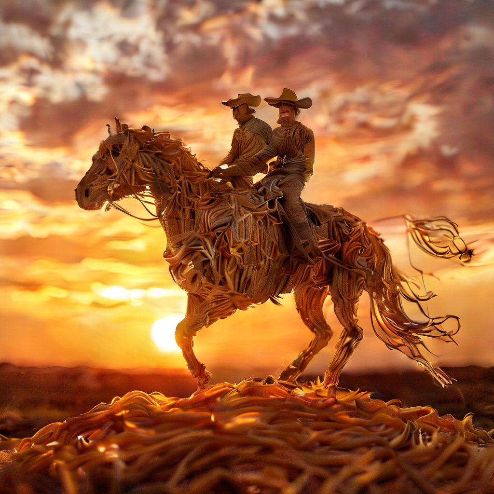
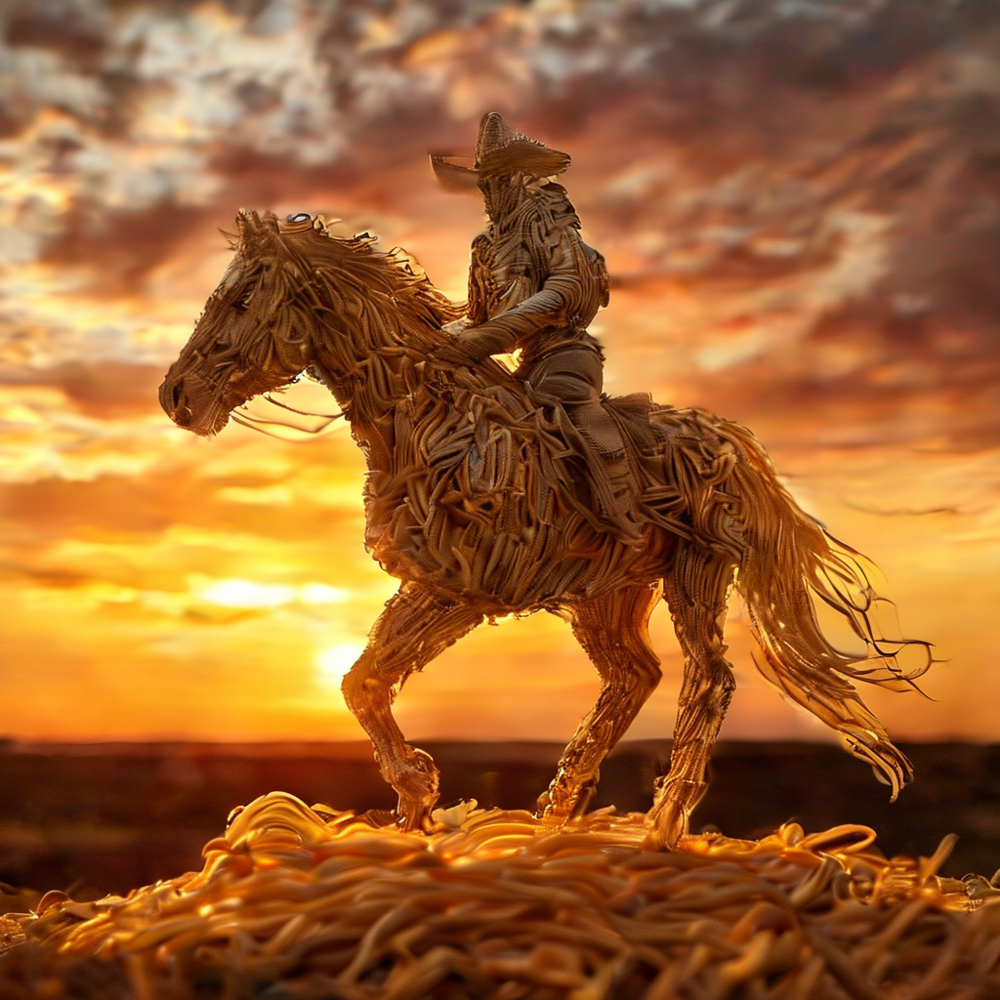
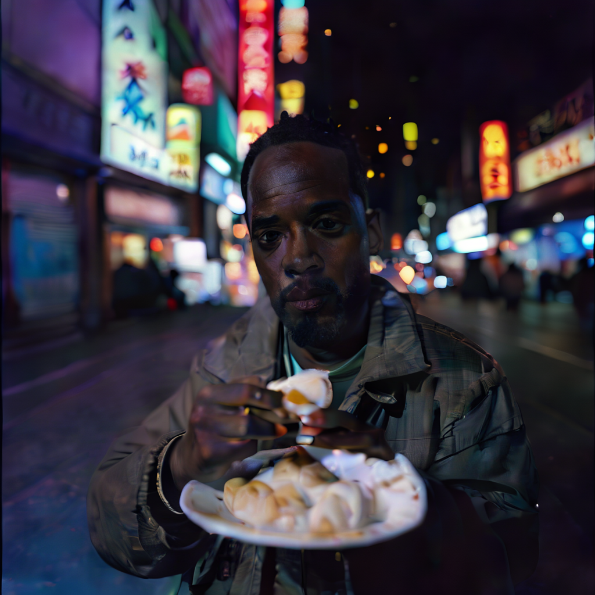
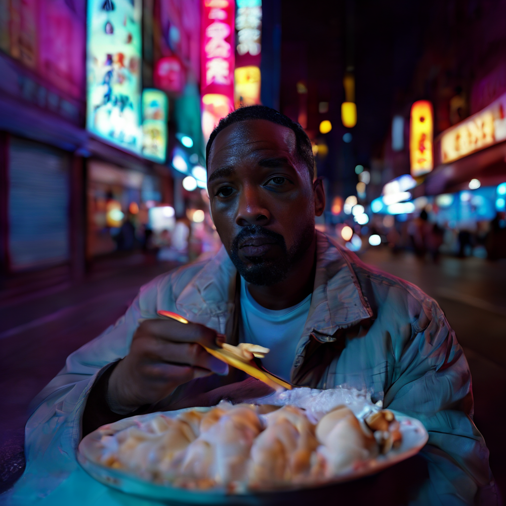
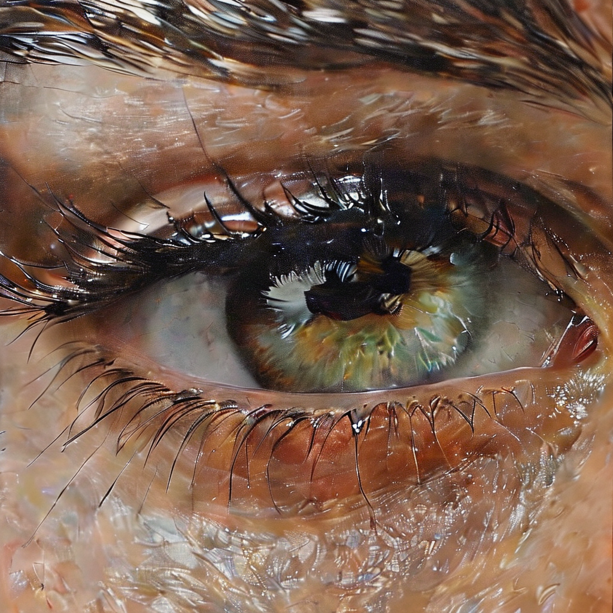
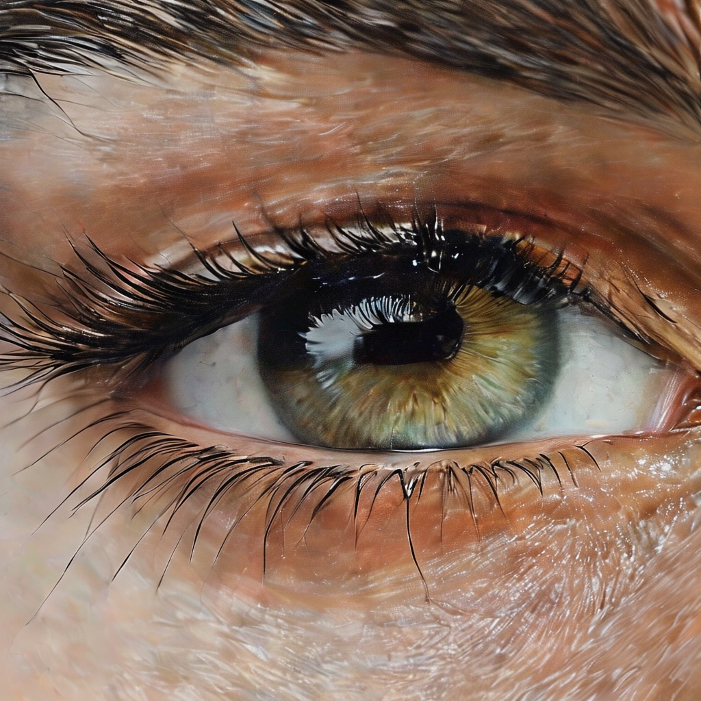
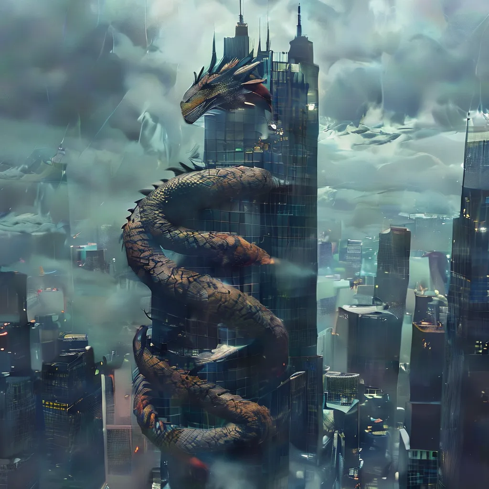
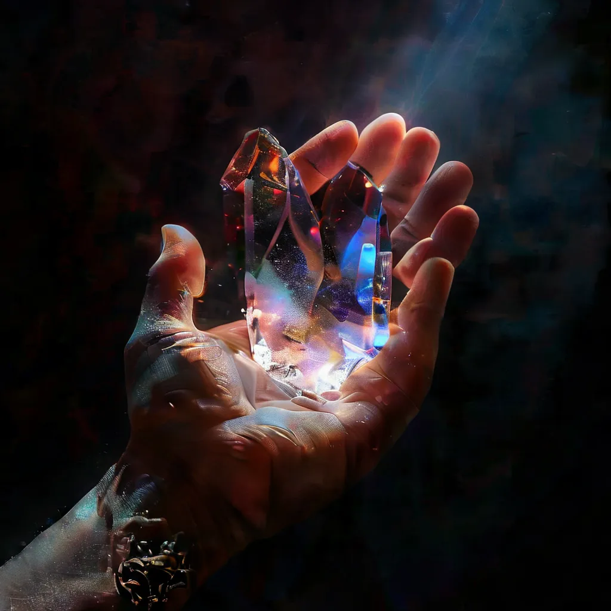
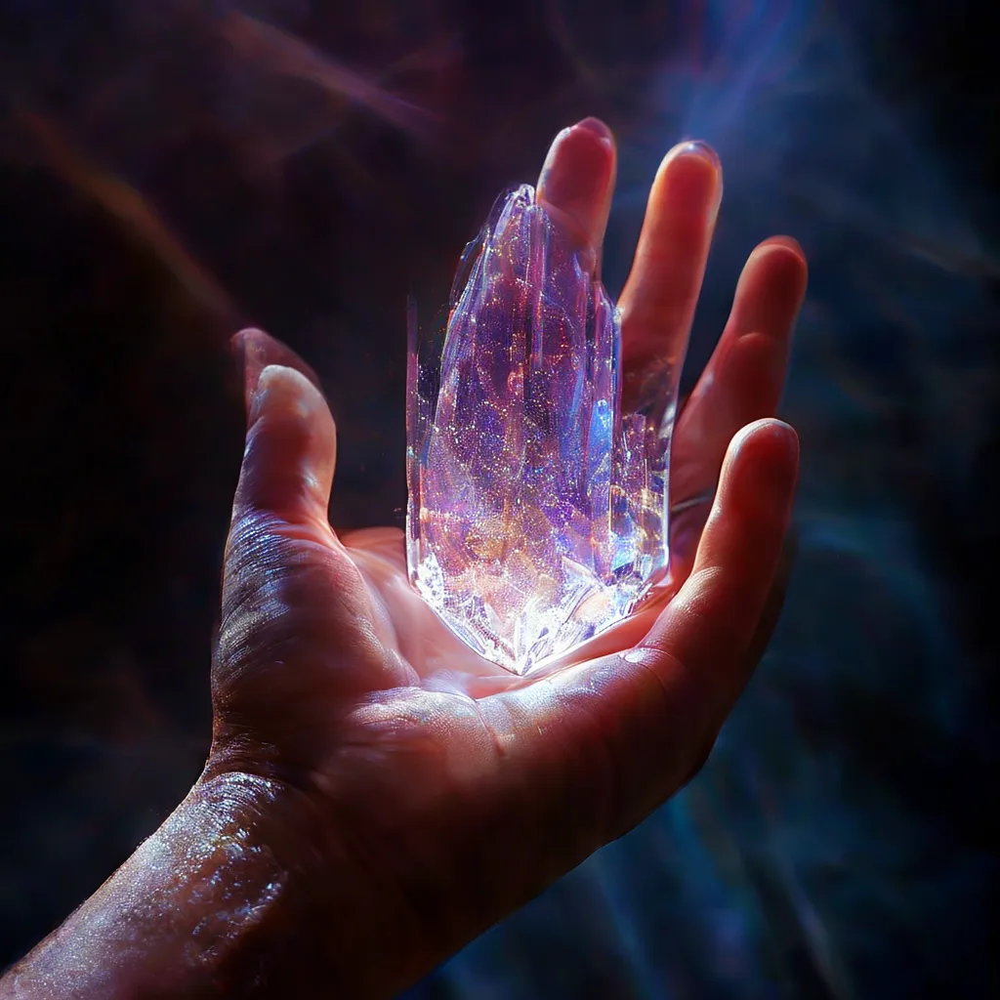

# ES-EGGROLL for Text-to-Image (T2I)

research repo for **post-train a frozen T2I model with black-box rewards** using **EGGROLL-style Evolution Strategies** on **LoRA weights** (no diffusion backprop).

---

## Main result (PartiPrompts, overall)

One image per prompt, **shared seeds** across models.

| Model | aesthetic ↑ | CLIP text sim ↑ | no artifacts ↑ | PickScore ↑ |
|---|---:|---:|---:|---:|
| SanaOneStep_Base | 0.5978 | 0.6592 | 0.3859 | 22.3220 |
| **SanaOneStep_eggroll (ES-LoRA)** | 0.5975 | **0.6611** | **0.3899** | **22.5013** |
| SanaTwoStep_Base (more compute) | 0.5965 | 0.6614 | 0.3926 | 22.8059 |

---

## Qualitative (Base vs ES-LoRA)

| Prompt | Base | ES-LoRA |
|---|---|---|
| spaghetti cowboy |  |  |
| Will Smith egg roll |  |  |
| close-up eyes |  |  |
| dragon + skyscraper |  |  |
| hand + crystal |  |  |
**Full prompts**
- **Neon egg roll (Will Smith):** `Will Smith eating an egg roll on a neon-lit street in Tokyo at night, cinematic, shallow depth of field, 35mm photography`
- **Spaghetti cowboy:** `spaghetti sculpture of a lone cowboy riding into the sunset, entire cowboy and horse made out of spaghetti, cinematic wide shot`
- **Eyes close-up:** `a close-up of human eyes with detailed eyelashes and reflections, ultra realistic`
- **Dragon around skyscraper:** `a dragon curled around a skyscraper in a modern city, overcast sky, realistic`
- **Hand + crystal:** `a hyper-detailed shot of a hand holding a translucent crystal, complex light refractions on a dark background, studio photography style`
- **Tiny astronaut on coffee cup:** `a tiny astronaut sitting on the rim of a coffee cup on a wooden desk, shallow depth of field, soft morning window light, ultra realistic, high detail on textures and reflections`
- **Butterfly glass cat:** `a cat with butterfly wings, its whole body is made of translucent glass`
- **Submarine:** `a submarine`
---

## What’s trained

- Backbone: **Sana Sprint one-step** (`Efficient-Large-Model/Sana_Sprint_1.6B_1024px_diffusers`)
- Trainable params: **LoRA only**
- Optimized reward: **PickScore v1**
- Extras are logged as diagnostics (CLIP text sim, aesthetic, no-artifacts)
